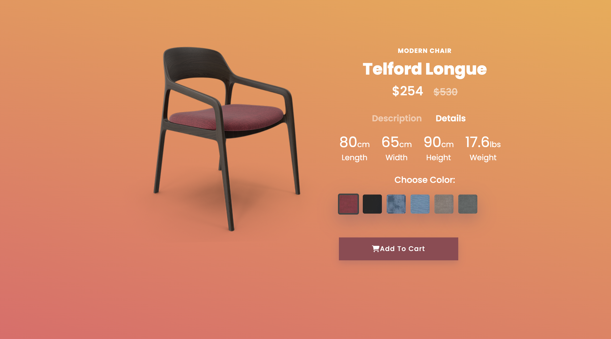
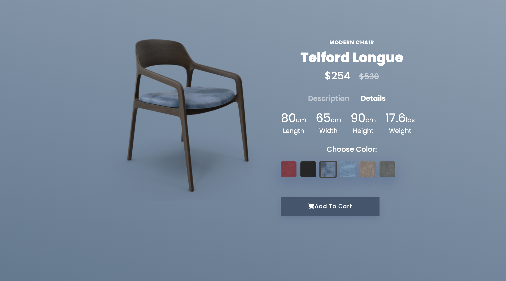
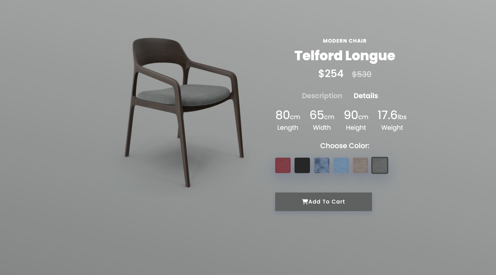

# 🪑 Modern Chair Color Switcher

This **Modern Chair** project is a stylish and interactive UI component built using **HTML and CSS only**. The chair changes its color when the user clicks on the available color options, demonstrating how powerful and creative CSS can be without any JavaScript.

---

## 🎯 Purpose

The project is designed to help understand and practice advanced CSS techniques, including layout, transitions, and interactivity — all without using any JavaScript.

---

## ✨ Features

- 🎨 Clickable color options to change chair color
- 🧼 Clean and modern design
- ⚡ Smooth transitions and interactions using pure CSS
- 📱 Fully responsive and mobile-friendly layout

---

## 🛠 Technologies Used

- **HTML5** – Page structure
- **CSS3** – Styling, transitions, and layout

---

## 🌟 Screenshots

> 
> 
> 

---

## 📁 How to Use

1. Clone the repository:

```bash
git clone https://github.com/paveshkanungo/Modern-Chair-Project.git
cd Modern-Chair-Project
```

2. Now, run through VS Code or browser.
